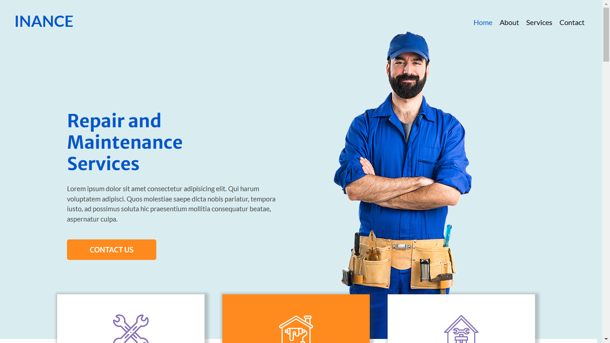

# INANCE Website template Challenge

This is a solution to the [Inance Repair service website template challenge](https://anudey.github.io/abc/). Made from scratch using HTML and CSS. Made Responsive using Bootstrap and media query.

## Table of contents

- [Overview](#overview)
  - [The challenge](#the-challenge)
  - [Screenshot](#screenshot)
  - [Links](#links)
- [My process](#my-process)
  - [Built with](#built-with)
  - [What I learned](#what-i-learned)
  - [Continued development](#continued-development)
- [Author](#author)

## Overview

### The challenge

Make the template from scratch and make it responsive.

### Screenshot

### Links

- Solution URL: [https://github.com/webdevsuman/INANCE](https://github.com/webdevsuman/INANCE)
- Live Site URL: [https://webdevsuman.github.io/INANCE](ttps://webdevsuman.github.io/INANCE)

## My process

I made the whole website for desktop screen with HTML and CSS. I have used Flexbox as well. Then in order to make it responsive I have used Bootstrap navbar, 12 column grid system and media query.

### Built with

- Semantic HTML5 markup
- CSS custom properties
- Flexbox
- Bootstrap grid
- media query
- fontawesome icons

### What I learned

This project has been a challenge. I have learned a lot of things. Like -

- Positioning property,

- SVG fill property in order to change its colour,

- Making reusable css class like making a blue or orange button and apply that class to the required areas,

- Filter property of image in order to change its colour,

- Applying Bootstrap javascript "data-bs-ride" to my custom buttons as I have used in the testimonial section,

- Making google map responsive to the screen size etc.

### Continued development

I am still curious how I can position correctly the Get in Touch section horizontal line which gets transformed into a vertical line in small screens. In the Follow Us section its the same thing - for small screens, the position is not yet correct. I would appreciate any helpful tips.

## Author

- Website - [Suman Das](https://github.com/webdevsuman/)
